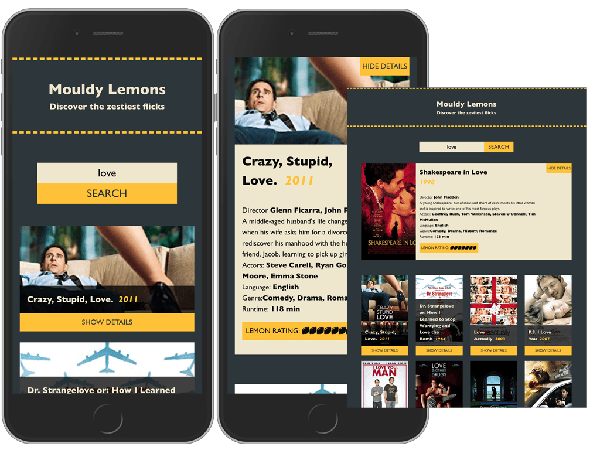

# Moudly Lemons

_Lemon-inspired title referencing my favourite movie reviewing website_

## A movie search engine powered by the Open Movie Database

Moudly Lemons is a single-page app built using React, powered by the [Open Movie Database](http://www.omdbapi.com) API, CSS mobile first, with tablet and desktop views.

### How it works

- The app first captures a search input and fetches data that matches the query from the OMDB API.
- It displays results returned in pages (10 results per page).
- Each movie shows a poster image, title and release date, each with a unique ID used to identify the movie when selected.
- Each time a movie is selected, a further API request is made to fetch additional details
- Additional details are displayed in a toggle-box - summary description, director, actors, genre etc

### Features

- Each movie has a "lemon rating" that converts the IMDB rating into an array of lemons
- Pagination to navigate back and forth to the extent of the results
- Visual cue to indicate when the search input is not filled
- "Zombie" placeholders as fallback when no movie poster supplied
- Page scroll functionality for viewing additional details (applied in mobile view only)

